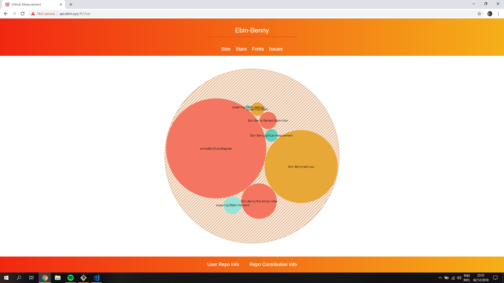
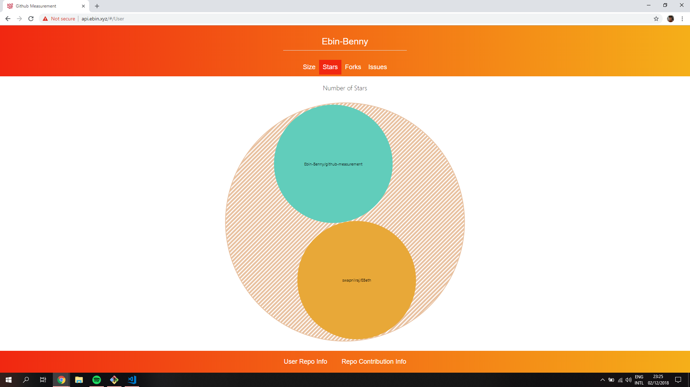
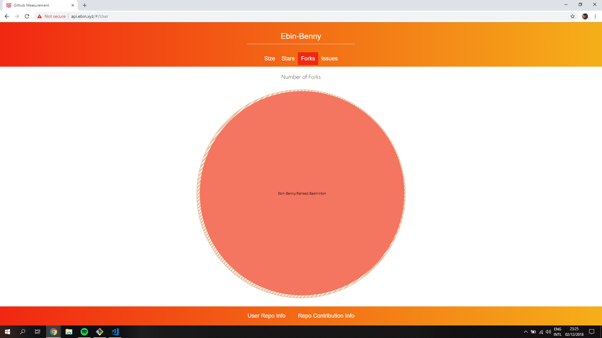
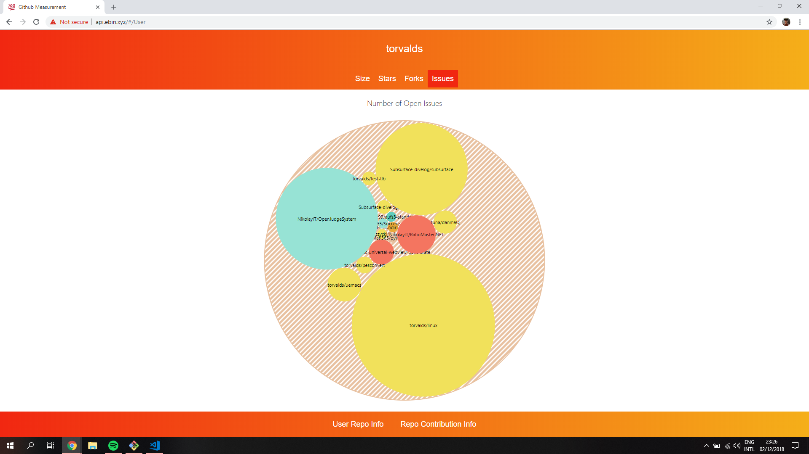
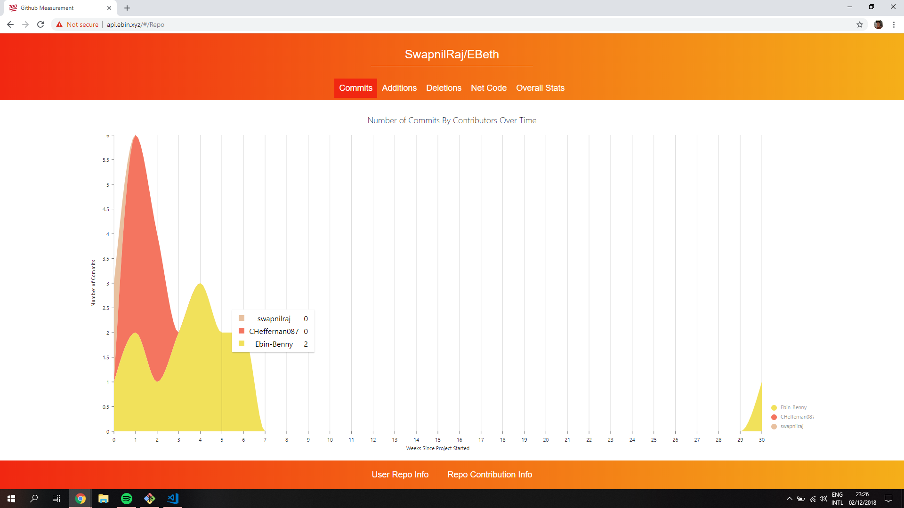
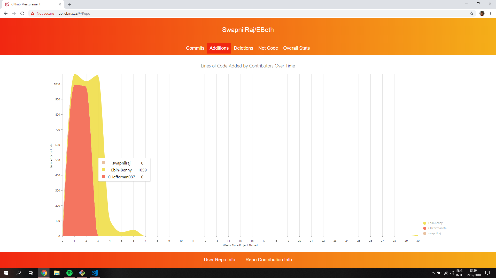
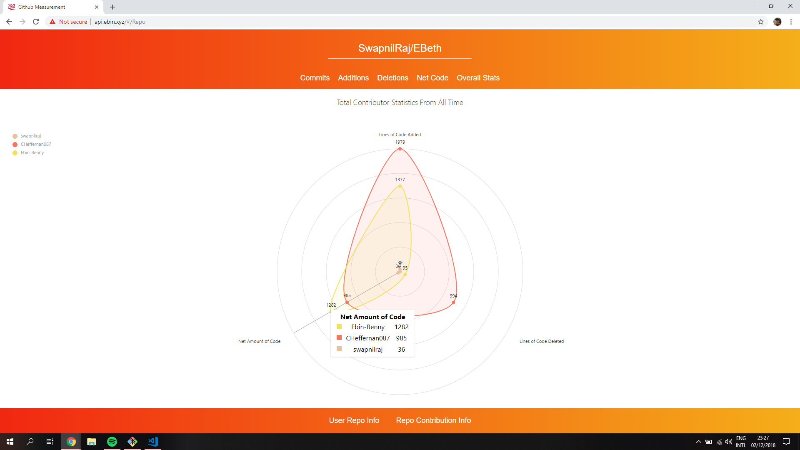

# Github Measurement
Github Measurement Web App for CS3012 by Ebin Benny (16319782). The front-end is a react based web app. It uses @nivo/rocks for the graphs, @nivo/rocks is a library built off d3.js for react. The backend uses express.js for handling requests and uses octokit/rest to get information from the github api. The backend server stores previously requested information inside a MongoDB database.

## Live

[http://api.ebin.xyz](http://api.ebin.xyz)

## Specs

Interrogate the GitHub API to build visualisation of data available that elucidates some aspect of the softare engineering process, such as a social graph of developers and projects, or a visualisation of indiviudal or team performance. Provide a visualisation of this using the d3js library.

## Screenshots

 <table style="width:100%">
  <tr>
    <th>Size of Users Repos.</th>
    <th>Stars of Users Repos.</th>
  </tr>
  <tr>
    <td></td>
    <td></td>
  </tr>
</table> 

 <table style="width:100%">
  <tr>
    <th>Fork Count of Users Repos.</th>
    <th>Open Issue Count of Users Repos.</th>
  </tr>
  <tr>
    <td></td>
    <td></td>
  </tr>
</table> 

<table style="width:100%">
  <tr>
    <th>Commits in Repo.</th>
    <th>Code Addition in Repo.</th>
  </tr>
  <tr>
    <td></td>
    <td></td>
  </tr>
</table> 

 <table style="width:100%">
  <tr>
    <th>Net Amount of Code.</th>
    <th>Total Stats of Repo.</th>
  </tr>
  <tr>
    <td></td>
    <td></td>
  </tr>
</table> 

## Usage

Start the backend firstly, follow the instructions in the following page.

[Backend](./backend/)

Start the frontend by following the instructions on the following page.

[Frontend](./frontend/)

